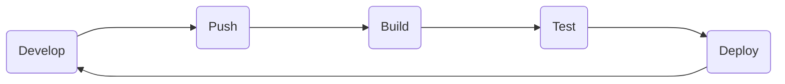
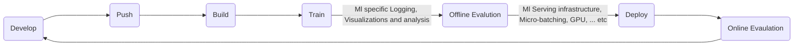

# learn_github_actions

### Github-actions
    Github actions have main 5 components in yaml file
    1. Events
    2. Jobs
    3. Runners
    4. Steps
    5. Actions

### Events
   Events contains the following keywords
   1. Github Triggered Events: push, pull_request, public
   2. Scheduled events: schedule
   3. Manually Triggerd: workflow_dispatch (External systems), trigger action workflow using third party system api, manual ... etc

### Workflow
   * Workflows are like pipelines
   * Have yml syntax

### Actions
   * Reusable units of code
   * Referencing vs authoring Actions
   * Administrative features
   * Storing Shared actions
   * Post Your actions to github marketplace

### Normal Application 

### Machine Learning applications

### Monlithic action
   * A action can do multiple things is called a monolithic action

### Chanable action